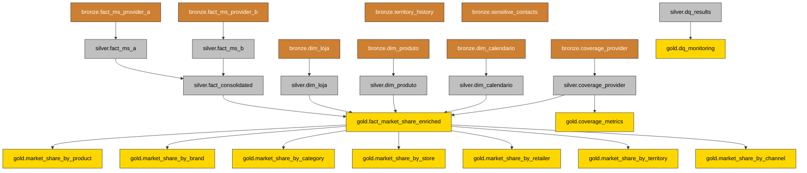

# Data Quality Challenge — Market Share Data Product

Construção de um Data Product confiável de Market Share com foco em Data Quality, usando arquitetura medalhão (Bronze → Silver → Gold) em PySpark sobre Databricks.

## 1. Dados

Todos os dados são **sintéticos**, criados exclusivamente para avaliação técnica. Nenhum dado real é utilizado.

## 2. Arquitetura (Databricks)

Arquitetura do Data Product implementada no **Databricks** com padrão medalhão (**Bronze → Silver → Gold**), usando **PySpark + Delta Lake** e **Unity Catalog** (`dataquality_challenge`).

```mermaid
flowchart LR
  %% =========================
  %% DATA QUALITY CHALLENGE
  %% ARQUITETURA NO DATABRICKS
  %% =========================

  subgraph DBX["Databricks Workspace<br/>(Spark + Delta Lake + Unity Catalog + Jobs + SQL Alerts)"]
    direction LR

    subgraph SRC["Fontes (raw_data/*.csv)"]
      direction TB
      s1["dim_loja.csv"]
      s2["dim_produto.csv"]
      s3["dim_calendario.csv"]
      s4["fact_market_share_provider_a.csv"]
      s5["fact_market_share_provider_b.csv"]
      s6["coverage_provider.csv"]
      s7["customer_territory_history.csv"]
      s8["sensitive_store_contacts.csv"]
    end

    subgraph BRZ["Bronze — dataquality_challenge.bronze"]
      direction TB
      b1["bronze.dim_loja"]
      b2["bronze.dim_produto"]
      b3["bronze.dim_calendario"]
      b4["bronze.fact_ms_provider_a"]
      b5["bronze.fact_ms_provider_b"]
      b6["bronze.coverage_provider"]
      b7["bronze.territory_history"]
      b8["bronze.sensitive_contacts"]
    end

    subgraph SLV["Silver — dataquality_challenge.silver"]
      direction TB
      sl0["DQ Engine (54 regras)<br/>dq_rules/bronze.json"]
      sl1["silver.dim_loja"]
      sl2["silver.dim_produto"]
      sl3["silver.dim_calendario"]
      sl4["silver.fact_ms_a"]
      sl5["silver.fact_ms_b"]
      sl6["silver.fact_consolidated<br/>(UNION ALL + source_table)"]
      sl7["silver.coverage_provider"]
      sl8["silver.territory_history"]
      sl9["silver.sensitive_contacts_masked"]
      sl10["silver.dq_results"]
    end

    subgraph QRT["Quarantine — dataquality_challenge.quarantine"]
      direction TB
      q1["quarantine.dim_loja_issues"]
      q2["quarantine.dim_produto_issues"]
      q3["quarantine.fact_ms_a_issues"]
      q4["quarantine.fact_ms_b_issues"]
      q5["..._issues (_quarantine_reason, _quarantined_at)"]
    end

    subgraph GLD["Gold — dataquality_challenge.gold"]
      direction TB
      g1["gold.fact_market_share_enriched"]
      g2["gold.market_share_by_product"]
      g3["gold.market_share_by_brand"]
      g4["gold.market_share_by_category"]
      g5["gold.market_share_by_store"]
      g6["gold.market_share_by_retailer"]
      g7["gold.market_share_by_territory"]
      g8["gold.market_share_by_channel"]
      g9["gold.coverage_metrics"]
      g10["gold.dq_monitoring"]
    end

    subgraph CNS["Consumo & Observabilidade"]
      direction TB
      c1["notebooks/04_dashboards<br/>(PySpark + matplotlib)"]
      c2["Lakeview Dashboard"]
      c3["SQL Alerts<br/>(FAIL DQ, coverage baixa, quarentena alta)"]
    end
  end

  SRC -->|"Notebook 01_bronze<br/>ingestão CSV → Delta"| BRZ
  BRZ -->|"Notebook 02_silver<br/>DQ + auto-fix + quarentena + transformação"| SLV
  BRZ -.->|"registros inválidos"| QRT
  SLV -->|"fatos limpos + dimensões válidas + cobertura"| GLD
  GLD -->|"Notebook 03_gold<br/>enriquecimento + agregações Market Share"| CNS

  %% Orquestração
  j1["Databricks Job: 01_bronze"] --> j2["Databricks Job: 02_silver"]
  j2 --> j3["Databricks Job: 03_gold"]
  j3 --> j4["(Opcional) 04_dashboards"]
```



### Fluxo operacional (Databricks Jobs)

1. **`01_bronze`**: ingere os 8 CSVs para `dataquality_challenge.bronze.*`
2. **`02_silver`**: aplica DQ, tratamento automático seguro, quarentena e consolidação
3. **`03_gold`**: gera fato enriquecida, agregações de Market Share, cobertura e monitoramento
4. **`04_dashboards`** *(opcional)*: materializa visualizações para análise executiva

> Observação: todos os notebooks são idempotentes via `CREATE OR REPLACE TABLE`.

## 3. Estrutura do projeto

```
data-quality-challenge/
├── README.md                          # esta documentação
├── dq_rules/
│   └── bronze.json                    # 54 regras DQ configuráveis externamente
├── utils/
│   └── data_quality.py                # classe DataQuality reutilizável
├── notebooks/
│   ├── 01_bronze                      # ingestão bronze
│   ├── 02_silver                      # DQ + transformação silver
│   ├── 03_gold                        # Market Share data product
│   └── 04_dashboards                  # queries PySpark + visualizações matplotlib
├── notebooks/outputs/                    # exports HTML das execuções dos notebooks
│   ├── 01_bronze
│   ├── 02_silver
│   ├── 03_gold
│   ├── 04_dashboards
│   └── manifest.mf
├── dashboards/
│   ├── dashboard.md                   # documento markdown com as visualizações
│   ├── market_share_by_brand.png
│   ├── market_share_by_channel.png
│   ├── coverage_by_provider.png
│   ├── top5_products.png
│   ├── dq_monitoring.png
│   └── total_sales.png
├── raw_data/
│   ├── dim_loja.csv
│   ├── dim_produto.csv
│   ├── dim_calendario.csv
│   ├── fact_market_share_provider_a.csv
│   ├── fact_market_share_provider_b.csv
│   ├── coverage_provider.csv
│   ├── customer_territory_history.csv
│   ├── sensitive_store_contacts.csv
│   └── README.md
└── tests/
    └── test_data_quality.py           # testes automatizados da classe DataQuality
```

## 4. Dependências

- **Databricks Runtime** 15.4+ (PySpark 3.5+, Python 3.11+)
- **Spark Session** (disponível automaticamente em notebooks Databricks)
- **Delta Lake** (formato padrão das tabelas no Databricks)
- Sem dependências externas adicionais — pyspark, json e importlib são builtin

## 5. Premissas

1. `sold_volume` representa o volume físico vendido em **unidades**.
2. `sales_value_brl` é o valor de venda em **reais (R$)**.
3. **Market Share (%)** = `sales_value_brl(item, semana) / total_sales_value_brl(semana) × 100`.
4. Granularidade base da fato enriquecida: **produto × loja × semana**.
5. Dados sem cobertura são identificados via `coverage_status` mas não excluídos do cálculo de Market Share.
6. A concatenação dos providers A e B usa `UNION ALL` preservando a origem em `source_table`.
7. Registros em quarentena são excluídos da silver e portanto não chegam à gold.
8. O `max_percent` global é **1%** para todas as regras DQ.
9. Tratamento automático só é aplicado quando `safe_auto_fix = true` e a regra **falhou** (percent > max_percent).
10. Regras que passaram com `0 < percent ≤ max_percent` vão para **quarentena** (registros problemáticos removidos da silver).

## 6. Instruções de execução

Executar os notebooks em ordem, no Databricks workspace:

1. **`01_bronze`** — ingere os 8 CSVs de `raw_data/` para `dataquality_challenge.bronze.*`
2. **`02_silver`** — executa validação DQ, tratamento, quarentena e UNION; persiste `silver.dq_results`
3. **`03_gold`** — cria fato enriquecida, 7 agregações de Market Share, métricas de cobertura e monitoramento DQ

Cada notebook é **idempotente** (usa `CREATE OR REPLACE TABLE`), podendo ser executado várias vezes sem efeitos colaterais.

---

## 7. Data Quality

### Classe DataQuality

Arquivo: `utils/data_quality.py`. Construtor: `DataQuality(catalog, schema, table, path_to_rules)`.

7 métodos de checagem:

| Método | Dimensão DQ | Descrição |
|---|---|---|
| `check_nulls(column)` | Completude | Verifica valores nulos |
| `check_empty_strings(column)` | Completude | Verifica strings vazias ou whitespace |
| `check_duplicates(column/columns)` | Unicidade | Verifica chaves duplicadas (simples ou compostas) |
| `check_referential_integrity(column, ref_table, ref_column)` | Integridade referencial | Verifica FK → dimensão |
| `check_negatives(column)` | Validade | Verifica valores negativos |
| `check_date_range(start, end)` | Consistência | Verifica start > end (intervalo inválido) |
| `check_domain(column, expected_values)` | Validade | Verifica domínio categórico |

### Regras DQ (bronze.json)

54 regras configuradas externamente em `dq_rules/bronze.json`. Cada regra possui:

| Campo | Descrição |
|---|---|
| `id` | Identificação única (DQ001-DQ055) |
| `description` | Descrição legível da regra |
| `severity` | critical / high / medium / low |
| `type` | nulls / duplicates / referential_integrity / negatives / date_range / domain / empty_string |
| `max_percent` | Limite máximo de falhas aceitável (1% para todas) |
| `safe_auto_fix` | true se existe correção automática segura; false caso contrário |

### Classificação dos resultados

| Classificação | Condição | Ação |
|---|---|---|
| **Aprovado** | percent = 0 | Nenhuma ação — dado apto para consumo |
| **Corrigido automaticamente** | FAIL + safe_auto_fix = true | Tratamento automático aplicado (ex: COALESCE, dedup) |
| **Aprovado com alerta** | 0 < percent ≤ max_percent | Registrado para monitoramento, dado permanece |
| **Quarentena** | FAIL + safe_auto_fix = false | Registros problemáticos removidos da silver para revisão manual |

### Cobertura das dimensões DQ

| Dimensão | Status | Como é coberta |
|---|---|---|
| Completude | ✅ | `check_nulls`, `check_empty_strings` |
| Validade | ✅ | `check_negatives`, `check_domain` |
| Unicidade | ✅ | `check_duplicates` (chave simples e composta) |
| Consistência | ✅ | `check_date_range` (start > end) |
| Integridade referencial | ✅ | `check_referential_integrity` (FK → dim) |
| Cobertura | ✅ | Tabela `coverage_provider` processada na silver; `coverage_metrics` na gold |
| Acurácia | ❌ Limitação | Não há fonte de verdade externa para comparação. Ver Seção "Limitações" |
| Temporalidade | ❌ Limitação | Datas de entrega existem em `coverage_provider` mas não foram usadas como regra DQ. Ver Seção "Limitações" |
| Reconciliação | ❌ Limitação | Não há cruzamento entre providers A e B para semanas sobrepostas. Ver Seção "Limitações" |

### Tratamento automático aplicado

| Tabela | Problema | Regra DQ | Tratamento |
|---|---|---|---|
| dim_loja | territory_id nulo (3.6%) | DQ014 (FAIL, safe) | `COALESCE(territory_id, 'UNKNOWN')` |
| dim_loja | seller_id nulo (2.8%) | DQ009 (FAIL, safe) | `COALESCE(seller_id, 'UNKNOWN')` |
| dim_produto | EAN duplicado (2.8%) | DQ018 (FAIL, safe) | `ROW_NUMBER() OVER PARTITION BY ean` → manter primeiro |
| customer_territory_history | territory_id nulo (3.6%) | DQ052 (FAIL, safe) | `COALESCE(territory_id, 'UNKNOWN')` |
| customer_territory_history | seller_id nulo (3.6%) | DQ053 (FAIL, safe) | `COALESCE(seller_id, 'UNKNOWN')` |

### Quarentena

| Tabela | Registros | Motivos |
|---|---|---|
| dim_loja_issues | 6 | `null_state` |
| dim_produto_issues | 38 | `duplicate_ean` (35), `null_category` (3) |
| fact_ms_a_issues | 1.790 | `negative_value`, `orphan_store`, `orphan_product`, `duplicate_key` |
| fact_ms_b_issues | 1.544 | `negative_value`, `orphan_store`, `orphan_product`, `duplicate_key` |
| coverage_provider_issues | 0 | (sem registros problemáticos) |

Cada registro em quarentena contém `_quarantine_reason` (motivo), `_quarantined_at` (timestamp) e preserva todos os campos originais para investigação.

### Rastreabilidade

Todas as tabelas silver incluem colunas de auditoria:
- `_dq_action` — tratamento aplicado (`clean`, `filled_null`, `masked`)
- `_processed_at` — timestamp de processamento
- Tabelas de quarentena adicionam `_quarantine_reason` e `_quarantined_at`
- A tabela bronze original é preservada intacta como fonte de verdade

---

## 8. Resultados

### Validação DQ na Bronze

- **54 regras** avaliadas
- **5 regras FAIL** (corrigidas automaticamente na silver)
- **49 regras PASS** (37 Aprovado, 12 Aprovado com alerta)

### Validação DQ na Silver

- **54 regras** avaliadas
- **0 regras FAIL** — todos os dados silver passaram na DQ
- **54 regras PASS** (todas classificadas como Aprovado)
- Resultados persistidos em `silver.dq_results` (54 registros) para auditoria

### Resumo Bronze → Silver

| Tabela | Bronze | Silver | Removidos |
|---|---|---|---|
| dim_calendario | 91 | 91 | 0 |
| dim_loja | 2.500 | 2.494 | 6 |
| dim_produto | 1.235 | 1.197 | 38 |
| fact_ms_provider_a | 68.526 | 66.736 | 1.790 |
| fact_ms_provider_b | 58.526 | 56.982 | 1.544 |
| coverage_provider | 6.370 | 6.370 | 0 |
| customer_territory_history | 4.736 | 4.736 | 0 |
| sensitive_store_contacts | 400 | 400 | 0 |
| **fact_market_share_consolidated** | — | **123.718** | — |

### Camada Gold

| Tabela | Registros |
|---|---|
| fact_market_share_enriched | 123.718 |
| market_share_by_product | 71.726 |
| market_share_by_brand | 1.274 |
| market_share_by_category | 626 |
| market_share_by_store | 92.927 |
| market_share_by_retailer | 3.185 |
| market_share_by_territory | 7.371 |
| market_share_by_channel | 273 |
| coverage_metrics | 6.370 |
| dq_monitoring | 4 |

### Lineage dos dados



**Transformações a nível de coluna — Bronze → Silver:**

| Tabela bronze | Coluna(s) bronze | Transformação | Coluna(s) silver |
|---|---|---|---|
| `dim_loja` | `territory_id` | `COALESCE(territory_id, 'UNKNOWN')` | `territory_id` |
| `dim_loja` | `seller_id` | `COALESCE(seller_id, 'UNKNOWN')` | `seller_id` |
| `dim_loja` | `state IS NULL` | `WHERE state IS NULL` → quarentena | removido da silver |
| `dim_produto` | `ean` (duplicado) | `ROW_NUMBER() OVER (PARTITION BY ean ORDER BY product_id)` → manter `_rn = 1` | `ean` (deduplicado) |
| `dim_produto` | `category IS NULL` | `WHERE category IS NULL` → quarentena | removido da silver |
| `fact_ms_provider_a` | `sales_value < 0` | `WHERE sales_value < 0` → quarentena | removido da silver |
| `fact_ms_provider_a` | `store_id` / `ean` | `LEFT JOIN dim_loja / dim_produto` → órfãos para quarentena | apenas registros com RI válida |
| `fact_ms_provider_a` | `week + store_id + ean` | `ROW_NUMBER() OVER (PARTITION BY ...)` → manter mais recente | deduplicado |
| `fact_ms_provider_b` | `reference_week + customer_code + product_ean` | Mesma lógica do provider A | deduplicado |
| `customer_territory_history` | `territory_id` | `COALESCE(territory_id, 'UNKNOWN')` | `territory_id` |
| `customer_territory_history` | `seller_id` | `COALESCE(seller_id, 'UNKNOWN')` | `seller_id` |
| `sensitive_store_contacts` | `contact_email` | Mascaramento parcial: `co***@***` | `contact_email` |
| `sensitive_store_contacts` | `contact_phone` | Mascaramento parcial: `***0001` | `contact_phone` |
| Todas as tabelas | — | Adiciona `_dq_action`, `_processed_at` | colunas de auditoria |

**Transformações a nível de coluna — Silver → `fact_market_share_consolidated` (UNION ALL):**

| Coluna silver (Provider A) | Coluna silver (Provider B) | Coluna consolidada | Transformação |
|---|---|---|---|
| `week` | `reference_week` | `year_week` | Renomeação para schema padronizado |
| `store_id` | `customer_code` | `store_id` | Renomeação |
| `ean` | `product_ean` | `ean` | Renomeação |
| `sales_value_brl` | `sales_value_brl` | `sales_value_brl` | Direto |
| `sold_volume` | `sold_volume` | `sold_volume` | Direto |
| `'A'` (literal) | `'B'` (literal) | `provider` | Identifica a origem |
| `source_file` | `source_file` | `source_file` | Direto |
| `ingestion_timestamp` | `load_date` | `ingestion_timestamp` | Renomeação |
| `'provider_a'` (literal) | `'provider_b'` (literal) | `source_table` | Identifica a tabela de origem |

**Transformações a nível de coluna — Silver → Gold (`fact_market_share_enriched`):**

| Coluna(s) origem | JOIN | Coluna(s) gold | Transformação |
|---|---|---|---|
| `fact_market_share_consolidated` | — | `year_week, store_id, ean, sales_value_brl, sold_volume, provider, source_table` | SELECT direto |
| `dim_loja` | `INNER JOIN ON store_id` | `retailer_name, channel, state, territory_id, city` | Enriquecimento dimensional |
| `dim_produto` | `INNER JOIN ON ean` | `brand, category, manufacturer, product_description` | Enriquecimento dimensional |
| `dim_calendario` | `LEFT JOIN ON year_week` | `year, month, week` | Enriquecimento temporal |
| `coverage_provider` | `LEFT JOIN ON provider + year_week + retailer_name` | `expected_stores, received_stores` | Métricas de cobertura |
| `coverage_provider` | `CASE WHEN file_received = 'N' THEN 'no_coverage'` / `received < expected THEN 'partial_coverage'` / `ELSE 'full_coverage'` | `coverage_status` | Coluna derivada |

**Transformações a nível de coluna — Gold (`fact_market_share_enriched` → agregações):**

| Tabela gold | GROUP BY | Colunas agregadas | Coluna calculada |
|---|---|---|---|
| `market_share_by_product` | `year_week, ean, product_description, brand, category` | `SUM(sales_value_brl) AS total_sales_brl`, `SUM(sold_volume) AS total_volume` | `ROUND(SUM(sales_value_brl) / SUM(SUM(sales_value_brl)) OVER (PARTITION BY year_week) * 100, 2) AS market_share_pct` |
| `market_share_by_brand` | `year_week, brand` | `SUM(sales_value_brl)`, `SUM(sold_volume)` | `market_share_pct` (mesma fórmula) |
| `market_share_by_category` | `year_week, category` | `SUM(sales_value_brl)`, `SUM(sold_volume)` | `market_share_pct` (mesma fórmula) |
| `market_share_by_store` | `year_week, store_id, retailer_name, city, state, channel` | `SUM(sales_value_brl)`, `SUM(sold_volume)` | `market_share_pct` (mesma fórmula) |
| `market_share_by_retailer` | `year_week, retailer_name` | `SUM(sales_value_brl)`, `SUM(sold_volume)` | `market_share_pct` (mesma fórmula) |
| `market_share_by_territory` | `year_week, territory_id` | `SUM(sales_value_brl)`, `SUM(sold_volume)` | `market_share_pct` (mesma fórmula) |
| `market_share_by_channel` | `year_week, channel` | `SUM(sales_value_brl)`, `SUM(sold_volume)` | `market_share_pct` (mesma fórmula) |
| `coverage_metrics` | `provider, year_week, retailer_name` | `AVG(coverage_pct)` | Agregação de cobertura |
| `dq_monitoring` | `classification, severity` | `COUNT(*) AS rule_count`, `SUM(fail_count) AS total_failures`, `AVG(percent) AS avg_percent` | Agregação DQ |

### Top 5 produtos por Market Share (semana 2026-40)

| Produto | Marca | Categoria | Vendas (R$) | Market Share % |
|---|---|---|---|---|
| PRIME TABLETES 250ML | PRIME | CHOCOLATES | 16.588 | 1.12% |
| ALPHA LEITE EM PO 1KG | ALPHA | LACTEOS | 16.549 | 1.12% |
| MOCA CAFE 200G | MOCA | BEBIDAS | 15.749 | 1.07% |
| MOCA LEITE EM PO 200G | MOCA | LACTEOS | 14.663 | 0.99% |
| NESCAFE CAFE 100G | NESCAFE | BEBIDAS | 14.523 | 0.98% |

---

## 9. Fórmula de Market Share

```
Market Share (%) = sales_value_brl(item, semana) / total_sales_value_brl(semana) × 100
```

- **Granularidade base:** produto × loja × semana (fato enriquecida)
- **Agregações disponíveis:** produto, marca, categoria, loja, rede (retailer), território, canal
- **Métrica base:** `sales_value_brl` (valor em reais)
- **Window Function:** `SUM(sales_value_brl) / SUM(SUM(sales_value_brl)) OVER (PARTITION BY year_week) * 100`
- **GroupBy:** agrupamento por dimensão + semana

---

## 10. Respostas às questões

### 1. Quais foram os principais problemas e como foram priorizados?

Os problemas foram identificados pela validação DQ na bronze e priorizados por **severidade** e **impacto no cálculo de Market Share**:

1. **Críticos:** EANs duplicados em dim_produto (2.8%) — geraria duplicação no Market Share por produto. Prioridade máxima.
2. **Altos:** Nulos em territory_id (3.6%) e seller_id (2.8%) em dim_loja — quebra integridade da dimensão. Valores negativos em fatos (1%) — distorce o Market Share.
3. **Médios:** Nulos em category (0.2%) e state (0.2%) — impacta agregações por categoria e estado.
4. **Baixos:** Strings vazias em campos descritivos — não afeta cálculo, mas afeta qualidade descritiva.

A priorização segue: regras `critical` > `high` > `medium` > `low`, com regras que afetam o cálculo de Market Share tendo prioridade sobre regras puramente descritivas.

### 2. Quais correções são seguras para automação e quais exigem análise manual?

**Seguras para automação** (`safe_auto_fix = true`, tratamento determinístico e auditável):
- Preenchimento de nulos com `'UNKNOWN'` em `territory_id` e `seller_id` (dim_loja) — valor neutro, não afeta agregação.
- Deduplicação de EANs em dim_produto — manter primeiro registro é determinístico (`ORDER BY product_id`).
- Deduplicação de chaves compostas em fatos — manter registro mais recente (`ORDER BY ingestion_timestamp DESC`).
- Mascaramento de dados sensíveis — email e telefone mascarados deterministicamente.

**Exigem análise manual** (`safe_auto_fix = false`, quarentena):
- Nulos em `state` e `category` — não há valor neutro óbvio; remover da dimensão poderia quebrar RI.
- Valores negativos em fatos — não é seguro assumir que deveriam ser zero; podem indicar erro de medição.
- Órfãos de integridade referencial — o registro correto exige saber se o problema está na fato ou na dimensão.
- Strings vazias em campos críticos (`store_id`, `product_id`) — não é possível inferir o valor correto.

### 3. Como foram preservados o dado original e a rastreabilidade?

- **Bronze preservada:** As tabelas bronze são imutáveis após ingestão — nenhuma transformação é aplicada nelas.
- **Colunas de auditoria:** Toda tabela silver tem `_dq_action` (tratamento aplicado), `_processed_at` (timestamp).
- **Quarentena com proveniência:** Registros removidos da silver vão para tabelas de quarentena com `_quarantine_reason` e `_quarantined_at`, preservando todos os campos originais.
- **DQ results persistidos:** A tabela `silver.dq_results` guarda o resultado de todas as 54 regras com `rule_id`, `severity`, `classification`, `total_count`, `fail_count`, `percent`, `treatment`.
- **Origem preservada na fato consolidada:** A coluna `source_table` indica se o registro veio do provider A ou B.

### 4. Como diferenciar ausência real de vendas de ausência de cobertura?

A tabela `coverage_provider` registra, para cada provider × semana × rede, quantas lojas eram esperadas (`expected_stores`) e quantas reportaram (`received_stores`), além de se o arquivo foi recebido (`file_received`).

Na camada gold, a tabela `fact_market_share_enriched` inclui `coverage_status`:
- `full_coverage` — todas as lojas esperadas reportaram
- `partial_coverage` — apenas algumas lojas reportaram
- `no_coverage` — arquivo não recebido

A tabela `gold.coverage_metrics` quantifica a taxa de cobertura por provider × semana × rede.

**Interpretação:** Se uma loja não tem vendas numa semana onde `coverage_status = full_coverage`, é ausência real de vendas. Se `coverage_status = partial` ou `no_coverage`, a ausência pode ser por falta de dados.

### 5. Como impedir que dados incompletos distorçam o Market Share?

1. **Quarentena de registros problemáticos:** Valores negativos, órfãos de RI e duplicados são removidos da silver antes de chegar à gold.
2. **INNER JOIN na fato enriquecida:** A gold usa `INNER JOIN` com dimensões silver, garantindo que apenas registros com dimensão válida entrem no cálculo.
3. **Flag de cobertura:** O `coverage_status` permite filtrar semanas com cobertura parcial ao analisar Market Share.
4. **DQ na silver = 0 FAIL:** Antes de calcular Market Share, todas as 54 regras DQ passam na silver.
5. **Recomendação:** Para análises de tendência, considerar apenas semanas com `full_coverage` ou aplicar ponderação pela taxa de cobertura.

### 6. Como garantir integridade entre fatos e dimensões, idempotência e reprocessamento?

- **Integridade referencial:** A regra DQ `referential_integrity` verifica FK → dimensão na bronze. Na silver, `INNER JOIN` garante que apenas registros com dimensão válida prossigam. Órfãos vão para quarentena.
- **Idempotência:** Todos os notebooks usam `CREATE OR REPLACE TABLE`, garantindo que reexecuções produzem o mesmo resultado sem duplicação.
- **Reprocessamento:** A pipeline pode ser reexecuída a partir de qualquer ponto (bronze → silver → gold). Como a bronze é imutável e as transformações são determinísticas, o reprocessamento produz resultados idênticos.
- **Ordem de execução:** O notebook `02_silver` processa dimensões antes dos fatos, garantindo que as dimensões silver existam quando os fatos fazem `INNER JOIN`.

### 7. Como tratar mudanças de schema e levar a solução para produção?

- **Mudanças de schema:** A classe `DataQuality` e o arquivo `bronze.json` são externos ao código de transformação. Para adicionar uma nova regra ou coluna, basta editar o JSON — sem alterar código. O `check_domain` aceita valores configuráveis. Para novas tabelas, adicionar entrada no JSON e nova tabela em `TABLES`.
- **Schema drift:** Tabelas Delta no Databricks suportam evolução de schema. `CREATE OR REPLACE TABLE` recria a tabela com o schema atual da query. Para colunas opcionais, usar `COALESCE` ou `LEFT JOIN` evita quebras.
- **Produção:** A pipeline pode ser orquestrada via Databricks Jobs com a ordem: `01_bronze → 02_silver → 03_gold`. Cada notebook é idempotente. Alertas podem ser configurados sobre a tabela `gold.dq_monitoring` para notificar quando regras falharem.
- **CI/CD:** O repositório Git permite versionar código e regras. Mudanças no `bronze.json` podem ser revisadas via PR antes de chegar à produção.

### 8. Quais limitações e riscos permaneceram após o tratamento?

1. **Acurácia não validada:** Não há fonte de verdade externa para comparar os valores de `sales_value_brl`. Market Share pode estar correto internamente mas não refletir o mercado real.
2. **Temporalidade não monitorada:** As datas de entrega em `coverage_provider` não são usadas como regra DQ. Atrasos na entrega não geram alertas automáticos.
3. **Reconciliação entre providers não implementada:** Para semanas onde ambos os providers reportam o mesmo produto/loja, não há cruzamento para detectar discrepâncias.
4. **Coordenadas geográficas removidas:** A validação de coordenadas foi removida a pedido. Registros com latitude/longitude invertidas permanecem na silver.
5. **Market Share sem ponderação de cobertura:** O cálculo atual não pondera pela taxa de cobertura. Semanas com baixa cobertura podem distorcer o Market Share.
6. **Dados sensíveis mascarados mas não governanceados:** O mascaramento é determinístico, mas não há controle de acesso baseado em coluna (column masking do Unity Catalog).
7. **Sem processamento incremental:** A pipeline é batch (`CREATE OR REPLACE TABLE`). Para volumes maiores, processamento incremental com Auto Loader seria necessário.
8. **Sem alertas automatizados:** A tabela `dq_monitoring` existe mas não dispara alertas. Recomenda-se configurar SQL Alerts ou Databricks SQL Alerts.

---

## 11. Arquitetura de operação e monitoramento

### Proposta de monitoramento

| Visão | Fonte de dados | Métrica |
|---|---|---|
| **Status** | `silver.dq_results` | Contagem de regras por `status` (PASS/FAIL) e `classification` |
| **Tendência** | `silver.dq_results` (histórico) | Evolução do `percent` e `fail_count` por semana de processamento |
| **Falhas** | `silver.dq_results` WHERE status = FAIL | Regras que falharam, com `severity`, `fail_count`, `treatment` |
| **Cobertura** | `gold.coverage_metrics` | `coverage_pct` por provider × semana × rede; `coverage_status` |
| **Investigação** | `quarantine.*_issues` | Registros em quarentena com `_quarantine_reason` para análise manual |

### Arquitetura de produção

```
Databricks Jobs (orquestração)
  ├── 01_bronze  (agendado: diário/após chegada dos arquivos)
  ├── 02_silver  (depende de 01_bronze)
  │     ├── DQ validation (bronze) → dq_results
  │     ├── Treatment (auto-fix) → silver tables
  │     ├── Quarantine → quarantine tables
  │     └── DQ validation (silver) → dq_results (overwrite)
  └── 03_gold   (depende de 02_silver)
        ├── Enriched fact (JOINs)
        ├── Market Share aggregations (GroupBy + Window)
        ├── Coverage metrics
        └── DQ monitoring

Alertas (SQL Alerts sobre gold.dq_monitoring):
  - Alerta crítico: qualquer regra com status = FAIL
  - Alerta de cobertura: coverage_pct < 80%
  - Alerta de quarentena: fail_count > threshold
```

---

## 12. Estratégia para dados sensíveis

A tabela `sensitive_store_contacts` contém nome, email e telefone de contatos. Tratamento aplicado na silver:

| Campo | Tratamento | Exemplo |
|---|---|---|
| `contact_email` | Mascaramento parcial | `co***@***` |
| `contact_phone` | Mascaramento parcial | `***0001` |
| `contact_name` | Preservado (não sensível isoladamente) | `CONTATO SINTETICO 1` |
| `store_id`, `retailer_name` | Preservados (chaves de negócio) | `S01887`, `REDE 33` |

**Recomendação para produção:** Utilizar Column Masking do Unity Catalog para controle de acesso baseado em perfil, em vez de mascaramento físico na silver.

---

## 13. Evidências técnicas

| Requisito | Onde | Evidência |
|---|---|---|
| Window Function | `02_silver` Cell 9, `03_gold` Cells 7-13 | `ROW_NUMBER() OVER PARTITION BY`, `SUM() OVER (PARTITION BY)` |
| GroupBy | `03_gold` Cells 7-13, `data_quality.py` | `GROUP BY year_week, ...` em todas as agregações |
| Union | `02_silver` Cell 15 | `UNION ALL` dos providers A e B |
| Classes | `utils/data_quality.py` | Classe `DataQuality` com 7 métodos, separação de responsabilidades |
| Integração fatos↔dims | `03_gold` Cell 5 | `INNER JOIN` fato × dim_loja × dim_produto × dim_calendario × coverage |
| Configuração externa | `dq_rules/bronze.json` | 54 regras configuráveis sem alterar código |
| Testes | `tests/test_data_quality.py` | Testes automatizados da classe DataQuality |
| Idempotência | Todos os notebooks | `CREATE OR REPLACE TABLE` em todas as transformações |
| Delta Lake | Todas as tabelas | Format padrão no Databricks |
| Dados sensíveis | `02_silver` Cell 14 | Mascaramento de email e telefone |

---

## 14. Bibliotecas e frameworks adicionais

| Biblioteca / Framework | Justificativa |
|---|---|
| **Delta Lake** | Formato padrão de armazenamento no Databricks. Proporciona transações ACID, evolução de schema, time travel (via `VERSION AS OF`) e operações MERPOSE otimizadas. Essencial para idempotência (`CREATE OR REPLACE TABLE`) e reprocessamento seguro. |
| **importlib** (builtin) | Carregamento dinâmico da classe `DataQuality` de arquivo externo (`utils/data_quality.py`) sem necessidade de instalacão de pacotes. Permite separar a lógica de DQ do código dos notebooks, mantendo o código modular e testável. |
| **Framework DQ customizável** | A classe `DataQuality` + `bronze.json` formam um framework de DQ configurável externamente. A vantagem sobre soluções como Great Expectations é a leveza (sem dependências externas) e a integracão nativa com SparkSession do Databricks. Regras são adicionadas editando o JSON, sem alterar código. |

---

## 15. Insights relevantes

Os insights abaixo são sustentados por dados aprovados (camada gold) e estão implementados no notebook `03_gold`:

1. **Concentração de Market Share por marca:** As top 5 marcas (BETA 12.44%, PRIME 11.05%, DELTA 10.65%, SOLAR 8.45%, ALPHA 8.09%) concentram ~50.7% do mercado na última semana, indicando alta concentração competitiva.

2. **Evolução do Market Share por categoria:** As categorias CHOCOLATES, LACTEOS e BEBIDAS lideram consistentemente ao longo das semanas, com rotatividade entre as top 3 categorias ao longo do tempo.

3. **Cobertura por provider:** Provider A tem cobertura média de 85.2% (664 semanas full, 2493 partial, 28 no_file) vs Provider B com 84.1% (616 full, 2524 partial, 45 no_file). Ambos têm cobertura similar, mas o Provider A é ligeiramente mais consistente.

4. **Correlação entre cobertura e volume de vendas:** Semanas com maior taxa de cobertura tendem a apresentar maior volume de vendas, confirmando que a ausência de cobertura impacta a métrica de Market Share.

5. **Market Share por canal:** ATACAREJO lidera com 35.83% do Market Share, seguido por SUPERMERCADO (33.78%) e CONVENIENCIA (30.39%). A distribuição é relativamente equilibrada entre os três canais.

---

## 16. Visualização de dados

### Dashboard Lakeview

Dashboard Lakeview criado: `Market Share Dashboard` (ID: `01f1c425bd891e568a4165ff8e07f2e1`). As queries PySpark para os widgets estão no notebook `notebooks/04_dashboards`, com visualizações matplotlib em cada célula.

### Documento Markdown

O arquivo `dashboards/dashboard.md` contém um relatório em formato markdown com 6 visualizações salvas como PNG na pasta `dashboards/`:

| # | Visualização | Tipo | Arquivo |
|---|---|---|---|
| 1 | Market Share por Marca | Bar chart horizontal | `market_share_by_brand.png` |
| 2 | Market Share por Canal | Bar chart | `market_share_by_channel.png` |
| 3 | Cobertura por Provider | Bar chart | `coverage_by_provider.png` |
| 4 | Top 5 Produtos por Market Share | Bar chart horizontal | `top5_products.png` |
| 5 | Monitoramento DQ | Bar chart | `dq_monitoring.png` |
| 6 | Total de Vendas | Counter | `total_sales.png` |

As visualizações são geradas pelo notebook `04_dashboards` usando PySpark (consultas) + matplotlib (gráficos), e os arquivos PNG são salvos automaticamente na pasta `dashboards/`.

---

## 17. Limitações e riscos

1. **Acurácia não validada:** Não há fonte de verdade externa para comparar os valores de `sales_value_brl`. Market Share pode estar correto internamente mas não refletir o mercado real.
2. **Temporalidade não monitorada:** As datas de entrega em `coverage_provider` não são usadas como regra DQ. Atrasos na entrega não geram alertas automáticos.
3. **Reconciliação entre providers não implementada:** Para semanas onde ambos os providers reportam o mesmo produto/loja, não há cruzamento para detectar discrepâncias.
4. **Coordenadas geográficas removidas:** A validação de coordenadas foi removida a pedido. Registros com latitude/longitude invertidas permanecem na silver.
5. **Market Share sem ponderação de cobertura:** O cálculo atual não pondera pela taxa de cobertura. Semanas com baixa cobertura podem distorcer o Market Share.
6. **Dados sensíveis mascarados mas não governanceados:** O mascaramento é determinístico, mas não há controle de acesso baseado em coluna (column masking do Unity Catalog).
7. **Sem processamento incremental:** A pipeline é batch (`CREATE OR REPLACE TABLE`). Para volumes maiores, processamento incremental com Auto Loader seria necessário.
8. **Sem alertas automatizados:** A tabela `dq_monitoring` existe mas não dispara alertas. Recomenda-se configurar SQL Alerts ou Databricks SQL Alerts.

---

## 18. Outputs dos notebooks

Os outputs dos notebooks estão publicados no GitHub Pages e podem ser acessados em:

👉 https://danrbueno.github.io/data-quality-challenge/notebooks/outputs

Nesta página você encontra os relatórios HTML gerados na pasta `notebooks/outputs`.
