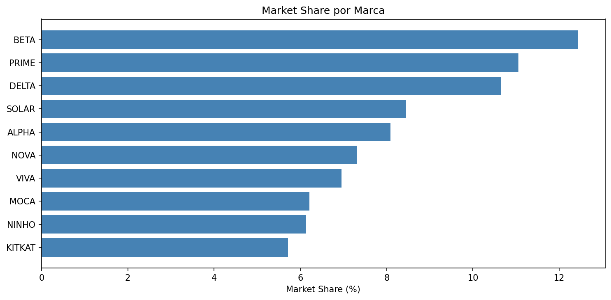
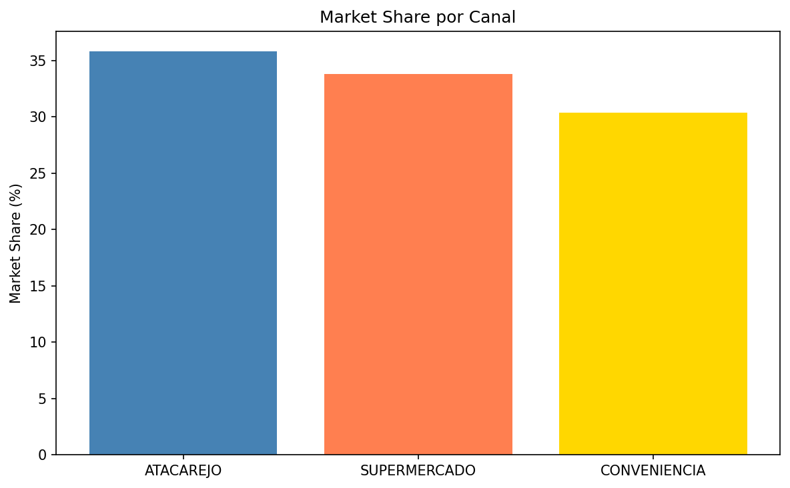
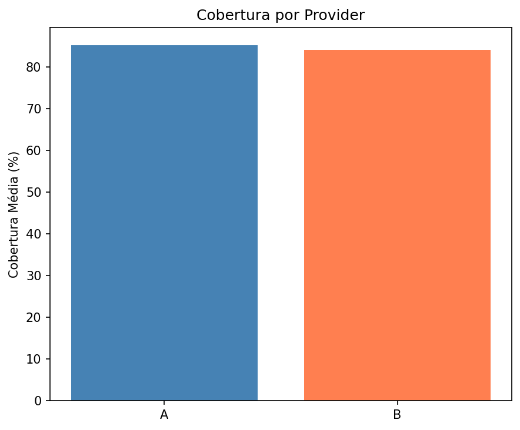
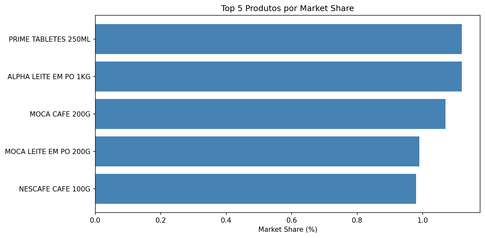
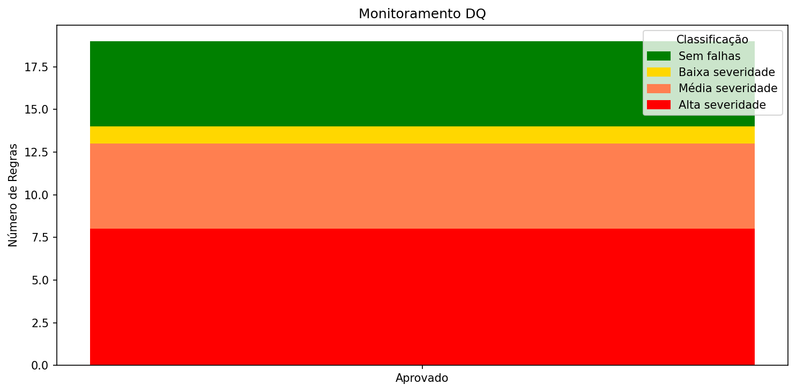
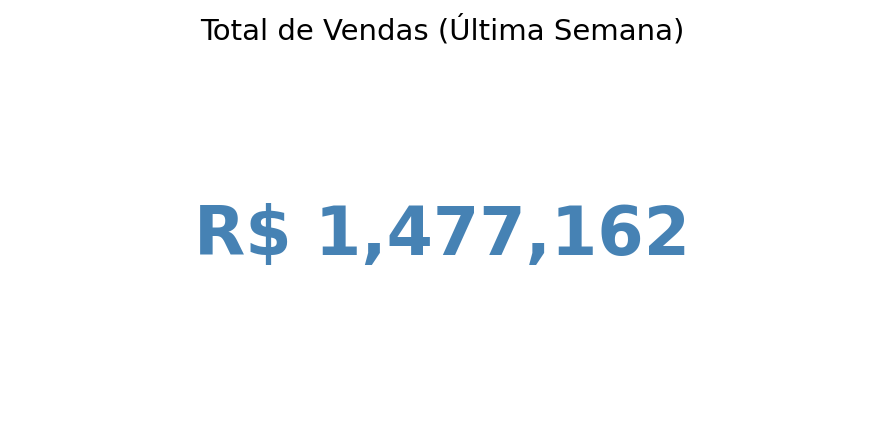

# Dashboard Market Share — Data Quality Challenge

Visualizações geradas a partir da camada gold (`dataquality_challenge.gold`) usando PySpark + matplotlib.

---

## 1. Market Share por Marca

Top 10 marcas por Market Share na última semana. As 5 maiores (BETA, PRIME, DELTA, SOLAR, ALPHA) concentram ~50.7% do mercado.

---

## 2. Market Share por Canal

Distribuição entre os 3 canais: ATACAREJO (35.83%), SUPERMERCADO (33.78%) e CONVENIENCIA (30.39%).

---

## 3. Cobertura por Provider

Cobertura média: Provider A (85.2%) vs Provider B (84.1%). Ambos têm cobertura similar, com Provider A ligeiramente mais consistente.

---

## 4. Top 5 Produtos por Market Share

PRIME TABLETES e ALPHA LEITE lideram com ~1.12% de Market Share cada.

---

## 5. Monitoramento DQ

54 regras de Data Quality — todas classificadas como Aprovado (0 falhas).

---

## 6. Total de Vendas

Total de vendas na última semana: **R$ 1.477.162**.

---

_Gerado em 2026-10-09. Fonte: `dataquality_challenge.gold`._
